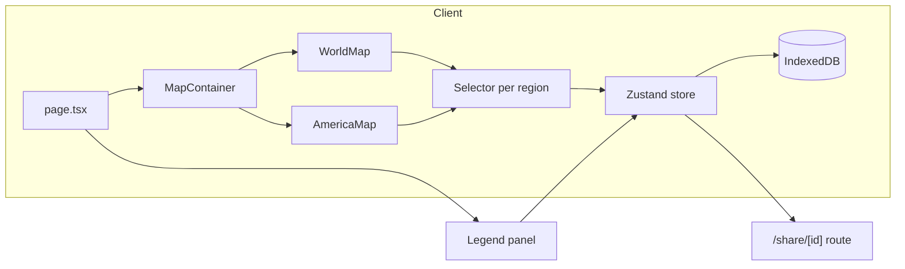

# Travel Buddy

Interactive map to track regions you've visited, driven through, or lived in. Built with Next.js, Tailwind CSS, shadcn/ui, Zustand, and react-simple-maps.

**Live site:** [https://travel-buddy.vercel.app](https://travel-buddy.vercel.app)

## Browser Compatibility

**Chromium-based browsers only** (Chrome, Edge, Arc, Brave). Safari and Firefox are not supported; non-Chromium users see a friendly fallback page.

## Stack

- **Framework:** [Next.js](https://nextjs.org) (App Router)
- **Styling:** [Tailwind CSS](https://tailwindcss.com)
- **Components:** [shadcn/ui](https://ui.shadcn.com)
- **State:** [Zustand](https://zustand-demo.pmnd.rs)
- **Maps:** [react-simple-maps](https://www.react-simple-maps.io)
- **Persistence:** [idb-keyval](https://github.com/jakearchibald/idb-keyval) (IndexedDB)
- **Testing:** Jest + React Testing Library (unit), Playwright (e2e)

## Architecture



## Development

```bash
# Install dependencies
pnpm install

# Start development server
pnpm dev

# Run unit tests with coverage
pnpm test:coverage

# Run e2e tests
pnpm test:e2e

# Type check
pnpm typecheck

# Lint
pnpm lint
```

## Deployment

- **Production:** `main` branch auto-deploys to Vercel
- **Preview:** Feature branches get preview URLs via Vercel
